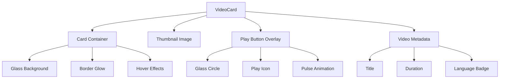
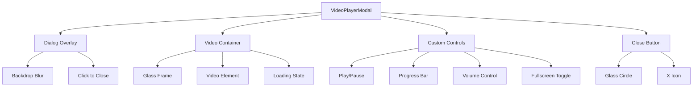
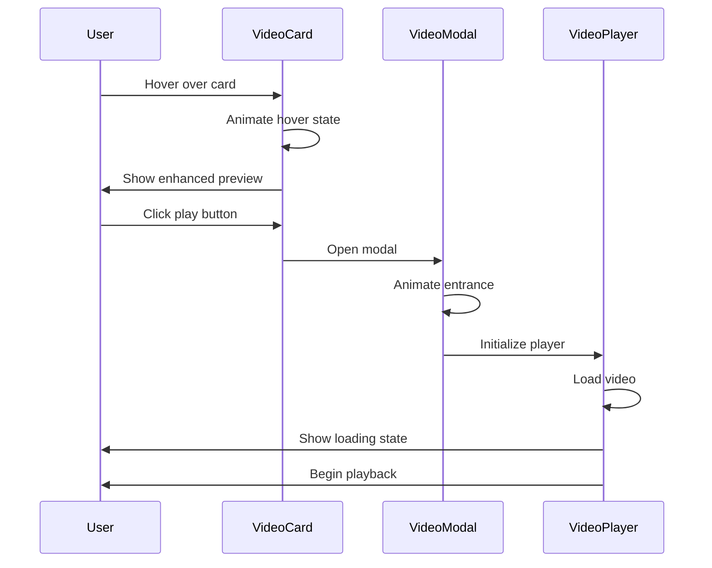
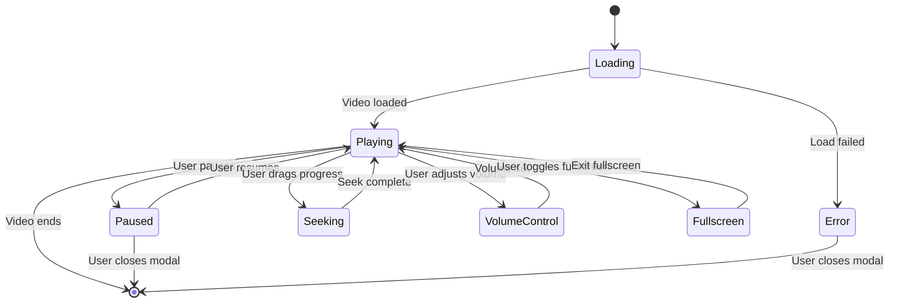

# Video Play Feature Design

## Overview

This document outlines the design for a modern video play feature with iOS-like glassmorphism effects for the datavise-ai application. The feature will allow users to click on cards to view videos with a premium, futuristic aesthetic that matches the existing dark theme and glass design system.

## Technology Stack & Dependencies

- **Video Player**: HTML5 video element with custom controls
- **Modal System**: Existing Radix UI Dialog components
- **Styling**: Tailwind CSS with custom glassmorphism utilities
- **Icons**: Lucide React for player controls
- **Animations**: CSS transitions and Tailwind animation utilities

## Component Architecture

### Video Card Component

The video card serves as the entry point for video playback, featuring:

- **Glass Card Design**: Leveraging existing `.glass-card` utility classes
- **Video Thumbnail**: Static image or video poster frame
- **Hover Effects**: Smooth transitions with glow and scale effects
- **Play Button Overlay**: Centered play icon with glass background



### Video Player Modal Component

The modal video player provides an immersive viewing experience with:

- **Full-Screen Backdrop**: Dark overlay with blur effect
- **Glass Container**: Semi-transparent video container
- **Custom Controls**: iOS-style control bar with glassmorphism
- **Progressive Enhancement**: Fallback to native controls



### Video Player Controls

Custom control interface featuring:

- **Play/Pause Button**: Large glass button with icon animation
- **Progress Bar**: Glass track with glowing progress indicator
- **Volume Control**: Expandable glass panel
- **Time Display**: Elegant typography with glass background
- **Fullscreen Toggle**: Glass button with expand icon

## Data Models & Video Management

### Video Data Structure

```typescript
interface VideoItem {
  id: string;
  title: string;
  description?: string;
  thumbnail: string;
  videoUrl: string;
  duration: number;
  language: 'english' | 'hindi';
  category?: string;
}
```

### Video Assets Configuration

```typescript
const videoAssets: VideoItem[] = [
  {
    id: 'system-work-english',
    title: 'How The System Works',
    description: 'Complete system overview and workflow explanation',
    thumbnail: '/src/assets/thumbnails/system-work-thumb.jpg',
    videoUrl: '/src/assets/videos/how_the_system_work_english_version.mp4',
    duration: 180, // seconds
    language: 'english',
    category: 'tutorial'
  },
  {
    id: 'system-work-hindi',
    title: 'सिस्टम कैसे काम करता है',
    description: 'पूर्ण सिस्टम अवलोकन और वर्कफ़्लो स्पष्टीकरण',
    thumbnail: '/src/assets/thumbnails/system-work-hindi-thumb.jpg',
    videoUrl: '/src/assets/videos/how_the_system_work_hindi_version.mp4',
    duration: 165,
    language: 'hindi',
    category: 'tutorial'
  }
];
```

## Styling Strategy

### Glassmorphism Design System

The video components will extend the existing glass effect utilities:

#### Enhanced Glass Effects

```css
.glass-video-card {
  background: linear-gradient(135deg, 
    rgba(34, 40, 60, 0.9) 0%, 
    rgba(59, 130, 246, 0.08) 100%);
  backdrop-filter: blur(20px) saturate(180%);
  border: 1px solid rgba(59, 130, 246, 0.3);
  box-shadow: 
    0 8px 32px rgba(31, 38, 135, 0.37),
    inset 0 1px 0 rgba(255, 255, 255, 0.1);
}

.glass-video-player {
  background: rgba(0, 0, 0, 0.85);
  backdrop-filter: blur(40px) saturate(150%);
  border: 1px solid rgba(255, 255, 255, 0.1);
  box-shadow: 
    0 25px 50px -12px rgba(0, 0, 0, 0.8),
    inset 0 1px 0 rgba(255, 255, 255, 0.05);
}

.glass-controls {
  background: rgba(255, 255, 255, 0.05);
  backdrop-filter: blur(20px) saturate(180%);
  border-top: 1px solid rgba(255, 255, 255, 0.1);
}
```

#### iOS-Inspired Animations

```css
.video-card-hover {
  transition: all 0.4s cubic-bezier(0.25, 0.46, 0.45, 0.94);
}

.video-card-hover:hover {
  transform: translateY(-8px) scale(1.02);
  box-shadow: 
    0 20px 40px rgba(59, 130, 246, 0.2),
    0 0 0 1px rgba(59, 130, 246, 0.4);
}

.play-button-pulse {
  animation: playPulse 2s ease-in-out infinite;
}

@keyframes playPulse {
  0%, 100% {
    box-shadow: 0 0 0 0 rgba(59, 130, 246, 0.7);
  }
  50% {
    box-shadow: 0 0 0 20px rgba(59, 130, 246, 0);
  }
}
```

## Component Implementation Details

### VideoCard Component Structure

```typescript
interface VideoCardProps {
  video: VideoItem;
  onPlay: (video: VideoItem) => void;
  className?: string;
}
```

#### Key Features:
- **Responsive Design**: Mobile-first with sm/md/lg breakpoints
- **Accessibility**: ARIA labels and keyboard navigation
- **Loading States**: Skeleton placeholder during image load
- **Error Handling**: Fallback for missing thumbnails

### VideoPlayerModal Component Structure

```typescript
interface VideoPlayerModalProps {
  video: VideoItem | null;
  isOpen: boolean;
  onClose: () => void;
}
```

#### Key Features:
- **Keyboard Controls**: Space for play/pause, ESC to close
- **Progressive Loading**: Video preload and buffer management
- **Responsive Video**: Aspect ratio preservation
- **Custom Controls**: iOS-style control overlay

### Video Controls Interface

#### Control Elements:
1. **Play/Pause Toggle**
   - Glass circle background
   - Smooth icon transition (play ↔ pause)
   - Pulse effect on hover

2. **Progress Bar**
   - Glass track with rounded edges
   - Glowing progress indicator
   - Draggable seek handle with haptic feedback

3. **Volume Control**
   - Collapsible glass panel
   - Vertical slider with glass thumb
   - Mute toggle with icon animation

4. **Time Display**
   - Current time / Total duration
   - Monospace font for stability
   - Glass background pill

5. **Fullscreen Toggle**
   - Glass button with expand/compress icon
   - Smooth transition animations

## User Experience Flow

### Video Discovery & Selection



### Video Playback Controls



## API Integration Layer

### Video Service Interface

```typescript
class VideoService {
  static async getVideoMetadata(videoUrl: string): Promise<VideoMetadata> {
    // Extract duration, resolution, and format information
  }
  
  static async generateThumbnail(videoUrl: string): Promise<string> {
    // Generate thumbnail from video first frame
  }
  
  static validateVideoFormat(file: File): boolean {
    // Validate supported video formats (mp4, webm, ogg)
  }
}
```

### Performance Optimization

#### Video Loading Strategy:
1. **Lazy Loading**: Videos load only when modal opens
2. **Preload Metadata**: Duration and poster frame preloaded
3. **Progressive Enhancement**: Fallback to native controls
4. **Adaptive Quality**: Future support for multiple resolutions

#### Caching Strategy:
1. **Thumbnail Caching**: Store generated thumbnails in localStorage
2. **Video Metadata**: Cache duration and format information
3. **User Preferences**: Remember volume and quality settings

## Testing Strategy

### Unit Testing

#### VideoCard Component Tests:
- Render with video data
- Handle click events
- Display correct thumbnail and metadata
- Responsive behavior across breakpoints

#### VideoPlayerModal Component Tests:
- Open/close modal functionality
- Video loading states
- Control interactions
- Keyboard navigation
- Error handling

### Integration Testing

#### User Journey Tests:
- Complete video playback flow
- Multiple video switching
- Fullscreen mode functionality
- Mobile touch interactions

### Visual Regression Testing

#### Glass Effect Consistency:
- Glassmorphism rendering across browsers
- Animation smoothness verification
- Color scheme adherence
- Responsive design validation

## Performance Considerations

### Optimization Strategies

1. **Video Asset Management**
   - Compress videos for web delivery
   - Generate multiple quality levels
   - Implement progressive download

2. **Component Optimization**
   - Lazy load video modal component
   - Optimize re-renders with React.memo
   - Efficient event listener management

3. **CSS Performance**
   - Use transform3d for hardware acceleration
   - Minimize backdrop-filter usage
   - Optimize animation keyframes

### Memory Management

1. **Video Element Cleanup**
   - Remove event listeners on unmount
   - Clear video sources when modal closes
   - Implement proper garbage collection

2. **State Management**
   - Minimize video player state
   - Clear unused video metadata
   - Optimize re-render cycles

## Accessibility & UX Considerations

### Keyboard Navigation

- **Tab Navigation**: Logical tab order through controls
- **Space Bar**: Play/pause toggle
- **Arrow Keys**: Seek forward/backward
- **Escape**: Close modal
- **F**: Toggle fullscreen

### Screen Reader Support

- **ARIA Labels**: Descriptive labels for all controls
- **Live Regions**: Announce playback status changes
- **Video Descriptions**: Alt text for video content
- **Focus Management**: Proper focus trapping in modal

### Motion Sensitivity

- **Reduced Motion**: Respect prefers-reduced-motion setting
- **Optional Animations**: Allow users to disable effects
- **Performance Mode**: Simplified UI for older devices

## Browser Compatibility

### Video Format Support

| Format | Chrome | Firefox | Safari | Edge |
|--------|--------|---------|--------|------|
| MP4    | ✅     | ✅      | ✅     | ✅   |
| WebM   | ✅     | ✅      | ❌     | ✅   |
| OGG    | ✅     | ✅      | ❌     | ❌   |

### Glassmorphism Support

- **Backdrop Filter**: Modern browsers (IE not supported)
- **CSS Grid**: Full support across target browsers
- **Custom Properties**: Full support for CSS variables
- **Flexbox**: Complete support for layout}
```

### Video Assets Configuration

```typescript
const videoAssets: VideoItem[] = [
  {
    id: 'system-work-english',
    title: 'How The System Works',
    description: 'Complete system overview and workflow explanation',
    thumbnail: '/src/assets/thumbnails/system-work-thumb.jpg',
    videoUrl: '/src/assets/videos/how_the_system_work_english_version.mp4',
    duration: 180, // seconds
    language: 'english',
    category: 'tutorial'
  },
  {
    id: 'system-work-hindi',
    title: 'सिस्टम कैसे काम करता है',
    description: 'पूर्ण सिस्टम अवलोकन और वर्कफ़्लो स्पष्टीकरण',
    thumbnail: '/src/assets/thumbnails/system-work-hindi-thumb.jpg',
    videoUrl: '/src/assets/videos/how_the_system_work_hindi_version.mp4',
    duration: 165,
    language: 'hindi',
    category: 'tutorial'
  }
];
```

## Styling Strategy

### Glassmorphism Design System

The video components will extend the existing glass effect utilities:

#### Enhanced Glass Effects

```css
.glass-video-card {
  background: linear-gradient(135deg, 
    rgba(34, 40, 60, 0.9) 0%, 
    rgba(59, 130, 246, 0.08) 100%);
  backdrop-filter: blur(20px) saturate(180%);
  border: 1px solid rgba(59, 130, 246, 0.3);
  box-shadow: 
    0 8px 32px rgba(31, 38, 135, 0.37),
    inset 0 1px 0 rgba(255, 255, 255, 0.1);
}

.glass-video-player {
  background: rgba(0, 0, 0, 0.85);
  backdrop-filter: blur(40px) saturate(150%);
  border: 1px solid rgba(255, 255, 255, 0.1);
  box-shadow: 
    0 25px 50px -12px rgba(0, 0, 0, 0.8),
    inset 0 1px 0 rgba(255, 255, 255, 0.05);
}

.glass-controls {
  background: rgba(255, 255, 255, 0.05);
  backdrop-filter: blur(20px) saturate(180%);
  border-top: 1px solid rgba(255, 255, 255, 0.1);
}
```

#### iOS-Inspired Animations

```css
.video-card-hover {
  transition: all 0.4s cubic-bezier(0.25, 0.46, 0.45, 0.94);
}

.video-card-hover:hover {
  transform: translateY(-8px) scale(1.02);
  box-shadow: 
    0 20px 40px rgba(59, 130, 246, 0.2),
    0 0 0 1px rgba(59, 130, 246, 0.4);
}

.play-button-pulse {
  animation: playPulse 2s ease-in-out infinite;
}

@keyframes playPulse {
  0%, 100% {
    box-shadow: 0 0 0 0 rgba(59, 130, 246, 0.7);
  }
  50% {
    box-shadow: 0 0 0 20px rgba(59, 130, 246, 0);
  }
}
```

## Component Implementation Details

### VideoCard Component Structure

```typescript
interface VideoCardProps {
  video: VideoItem;
  onPlay: (video: VideoItem) => void;
  className?: string;
}
```

#### Key Features:
- **Responsive Design**: Mobile-first with sm/md/lg breakpoints
- **Accessibility**: ARIA labels and keyboard navigation
- **Loading States**: Skeleton placeholder during image load
- **Error Handling**: Fallback for missing thumbnails

### VideoPlayerModal Component Structure

```typescript
interface VideoPlayerModalProps {
  video: VideoItem | null;
  isOpen: boolean;
  onClose: () => void;
}
```

#### Key Features:
- **Keyboard Controls**: Space for play/pause, ESC to close
- **Progressive Loading**: Video preload and buffer management
- **Responsive Video**: Aspect ratio preservation
- **Custom Controls**: iOS-style control overlay

### Video Controls Interface

#### Control Elements:
1. **Play/Pause Toggle**
   - Glass circle background
   - Smooth icon transition (play ↔ pause)
   - Pulse effect on hover

2. **Progress Bar**
   - Glass track with rounded edges
   - Glowing progress indicator
   - Draggable seek handle with haptic feedback

3. **Volume Control**
   - Collapsible glass panel
   - Vertical slider with glass thumb
   - Mute toggle with icon animation

4. **Time Display**
   - Current time / Total duration
   - Monospace font for stability
   - Glass background pill

5. **Fullscreen Toggle**
   - Glass button with expand/compress icon
   - Smooth transition animations

## User Experience Flow

### Video Discovery & Selection


### Video Playback Controls


## API Integration Layer

### Video Service Interface

```typescript
class VideoService {
  static async getVideoMetadata(videoUrl: string): Promise<VideoMetadata> {
    // Extract duration, resolution, and format information
  }
  
  static async generateThumbnail(videoUrl: string): Promise<string> {
    // Generate thumbnail from video first frame
  }
  
  static validateVideoFormat(file: File): boolean {
    // Validate supported video formats (mp4, webm, ogg)
  }
}
```

### Performance Optimization

#### Video Loading Strategy:
1. **Lazy Loading**: Videos load only when modal opens
2. **Preload Metadata**: Duration and poster frame preloaded
3. **Progressive Enhancement**: Fallback to native controls
4. **Adaptive Quality**: Future support for multiple resolutions

#### Caching Strategy:
1. **Thumbnail Caching**: Store generated thumbnails in localStorage
2. **Video Metadata**: Cache duration and format information
3. **User Preferences**: Remember volume and quality settings

## Testing Strategy

### Unit Testing

#### VideoCard Component Tests:
- Render with video data
- Handle click events
- Display correct thumbnail and metadata
- Responsive behavior across breakpoints

#### VideoPlayerModal Component Tests:
- Open/close modal functionality
- Video loading states
- Control interactions
- Keyboard navigation
- Error handling

### Integration Testing

#### User Journey Tests:
- Complete video playback flow
- Multiple video switching
- Fullscreen mode functionality
- Mobile touch interactions

### Visual Regression Testing

#### Glass Effect Consistency:
- Glassmorphism rendering across browsers
- Animation smoothness verification
- Color scheme adherence
- Responsive design validation

## Performance Considerations

### Optimization Strategies

1. **Video Asset Management**
   - Compress videos for web delivery
   - Generate multiple quality levels
   - Implement progressive download

2. **Component Optimization**
   - Lazy load video modal component
   - Optimize re-renders with React.memo
   - Efficient event listener management

3. **CSS Performance**
   - Use transform3d for hardware acceleration
   - Minimize backdrop-filter usage
   - Optimize animation keyframes

### Memory Management

1. **Video Element Cleanup**
   - Remove event listeners on unmount
   - Clear video sources when modal closes
   - Implement proper garbage collection

2. **State Management**
   - Minimize video player state
   - Clear unused video metadata
   - Optimize re-render cycles

## Accessibility & UX Considerations

### Keyboard Navigation

- **Tab Navigation**: Logical tab order through controls
- **Space Bar**: Play/pause toggle
- **Arrow Keys**: Seek forward/backward
- **Escape**: Close modal
- **F**: Toggle fullscreen

### Screen Reader Support

- **ARIA Labels**: Descriptive labels for all controls
- **Live Regions**: Announce playback status changes
- **Video Descriptions**: Alt text for video content
- **Focus Management**: Proper focus trapping in modal

### Motion Sensitivity

- **Reduced Motion**: Respect prefers-reduced-motion setting
- **Optional Animations**: Allow users to disable effects
- **Performance Mode**: Simplified UI for older devices

## Browser Compatibility

### Video Format Support

| Format | Chrome | Firefox | Safari | Edge |
|--------|--------|---------|--------|------|
| MP4    | ✅     | ✅      | ✅     | ✅   |
| WebM   | ✅     | ✅      | ❌     | ✅   |
| OGG    | ✅     | ✅      | ❌     | ❌   |

### Glassmorphism Support

- **Backdrop Filter**: Modern browsers (IE not supported)
- **CSS Grid**: Full support across target browsers
- **Custom Properties**: Full support for CSS variables
- **Flexbox**: Complete support for layout


