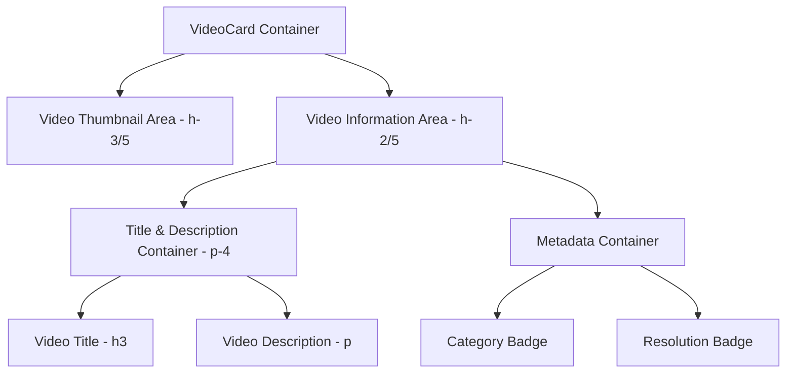
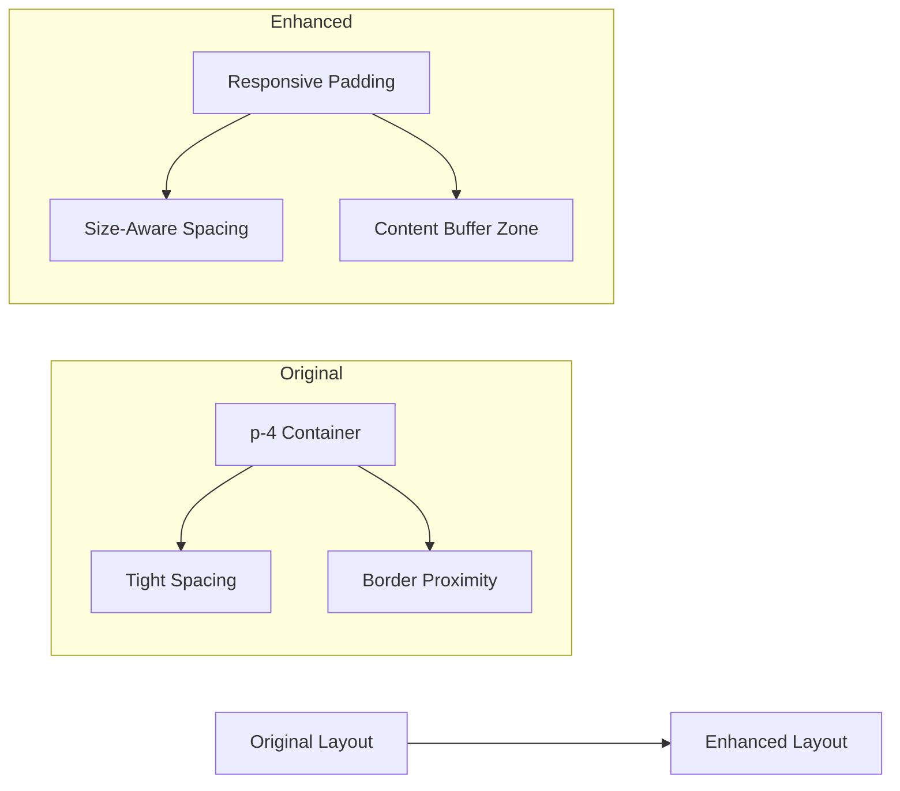

# Video Title Padding Adjustment Design

## Overview

This design addresses the issue where video titles and content in VideoCard components are getting too close to the card borders, potentially overlapping or creating poor visual spacing. The solution involves adjusting padding and spacing in the VideoCard component to ensure proper content containment within the glassmorphism card design.

## Architecture

### Current Structure Analysis



### Identified Issues

1. **Insufficient Content Padding**: The current `p-4` (16px) padding in the video information section may be insufficient for larger text content
2. **Border Proximity**: Video titles with longer text can approach the card borders, especially on smaller card sizes
3. **Responsive Spacing**: Padding doesn't adjust based on card size variants (small, medium, large)

## Component Modifications

### Video Information Container Padding Enhancement

The video information section currently uses a fixed `p-4` class. The solution involves:

1. **Increased Base Padding**: Upgrade from `p-4` (16px) to `p-6` (24px) for better breathing room
2. **Size-Responsive Padding**: Implement different padding values based on card size variants
3. **Content-Aware Spacing**: Ensure adequate space between title, description, and metadata sections

### Padding Strategy by Card Size

```typescript
// Size-based padding classes
const getPaddingClasses = (size: 'small' | 'medium' | 'large') => {
  switch (size) {
    case 'small':
      return 'px-4 py-3';  // Smaller horizontal padding for compact cards
    case 'large':
      return 'px-8 py-6';  // Generous padding for larger cards
    default:
      return 'px-6 py-5';  // Enhanced padding for medium cards
  }
};
```

### Text Content Spacing Improvements

1. **Title Margin**: Add proper margin below the title element
2. **Description Gap**: Ensure sufficient spacing between title and description
3. **Metadata Separation**: Maintain clear separation between content and metadata

### Layout Adjustments



## Implementation Details

### Component Structure Updates

1. **Dynamic Padding Application**:
   - Replace fixed `p-4` with size-responsive padding function
   - Apply horizontal and vertical padding separately for better control

2. **Content Container Refinements**:
   - Add consistent spacing between title and description
   - Ensure metadata section has proper top margin
   - Maintain vertical spacing hierarchy

3. **Responsive Considerations**:
   - Adjust padding based on screen size breakpoints
   - Ensure content remains readable on all device sizes
   - Maintain glassmorphism aesthetic with proper spacing

### CSS Utility Integration

The solution leverages existing Tailwind CSS utilities while adding size-specific spacing:

- `px-4 py-3`: Small card padding
- `px-6 py-5`: Medium card padding (default)
- `px-8 py-6`: Large card padding

### Visual Hierarchy Maintenance

1. **Title Prominence**: Maintain title as the primary visual element with adequate spacing
2. **Description Flow**: Ensure description text has proper line-height and spacing
3. **Metadata Positioning**: Keep metadata section clearly separated from main content

## Testing

### Visual Validation Points

1. **Border Clearance**: Verify no content touches card borders
2. **Text Readability**: Ensure all text content has sufficient padding
3. **Size Consistency**: Test all card size variants (small, medium, large)
4. **Responsive Behavior**: Validate spacing across different screen sizes

### Edge Case Testing

1. **Long Titles**: Test with extended video titles
2. **Multi-line Content**: Verify proper spacing with wrapped text
3. **Missing Content**: Ensure layout stability when description is absent
4. **Various Languages**: Test with different language content lengths

## Expected Outcomes

1. **Improved Content Spacing**: All text content will have adequate breathing room from card borders
2. **Enhanced Visual Hierarchy**: Clear separation between title, description, and metadata sections
3. **Consistent Experience**: Uniform spacing across all card size variants
4. **Maintained Aesthetic**: Preserved glassmorphism design while improving content layout
5. **Better Accessibility**: Improved text readability through proper spacing

The implementation ensures that video titles and all content within VideoCard components maintain proper distance from borders while preserving the existing glassmorphism design aesthetic and responsive behavior.